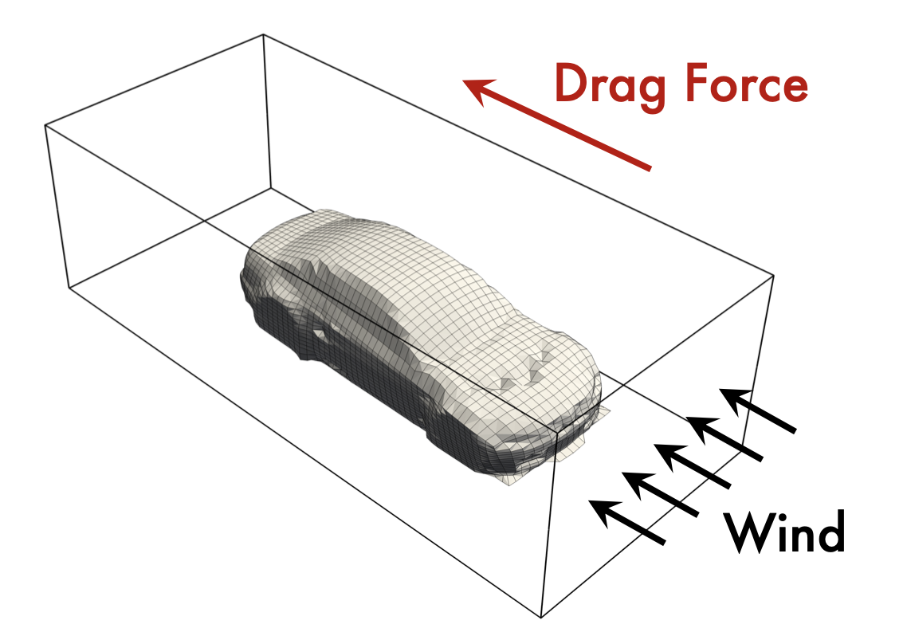

# HAET: Hierarchical Attention for Large-Scale Car Aerodynamics

We demonstrate the effectiveness of **HAET** (Hierarchical Attention Erwin Transolver) on industrial-scale car design tasks. Our approach combines [Transolver++](https://arxiv.org/abs/2404.02414)'s efficient slicing and adaptive physical tokenization with Erwin's scalable ball-tree-based attention.

In this task, the model predicts surrounding wind speed and surface pressure on a 3D car mesh, while estimating the [drag coefficient](https://en.wikipedia.org/wiki/Drag_coefficient) to guide aerodynamic optimization.

<p align="center">

<br><br>
<b>Figure 1.</b> Car design task involving wind and pressure field estimation.
</p>

We evaluate the model's accuracy using relative error and [Spearman's rank correlation](https://en.wikipedia.org/wiki/Spearman%27s_rank_correlation_coefficient), which measures the model's ability to rank different designs by aerodynamic performance.

## 🚀 Get Started

1. **Install dependencies**

```bash
pip install -r requirements.txt
```

👉 Note: Install [pytorch\_geometric](https://github.com/pyg-team/pytorch_geometric) separately.

2. **Prepare dataset**

Download the raw dataset [\[here\]](http://www.nobuyuki-umetani.com/publication/mlcfd_data.zip), originally provided by [Nobuyuki Umetani](https://dl.acm.org/doi/abs/10.1145/3197517.3201325).

3. **Train and evaluate**

Example scripts are provided under `./scripts/`:

```bash
bash scripts/Transolver.sh   # Train
bash scripts/Evaluation.sh   # Evaluate
```

📝 Remember to update `--data_dir` (raw data) and `--save_dir` (preprocessed output). You can use `--preprocessed True` to skip regeneration.

4. **Develop your own model**

* Add your model under `./models/`
* Register it in `main.py`
* Create a corresponding script in `./scripts/`

## 🔍 Eidetic State Visualization

HAET learns **eidetic states** that capture hidden physical properties using Rep-Slice and Ada-Temp. This results in meaningful grouping of mesh regions like the windshield or license plate into consistent physical slices.

<p align="center">

<br><br>
<b>Figure 2.</b> Visualization of physically informed slices learned by HAET.
</p>

## 🔬 Showcases

HAET delivers state-of-the-art performance with significant memory savings, especially in complex, high-resolution geometries.

## 🙏 Acknowledgement

We thank the following works and authors for their inspiring contributions and datasets:

* [https://dl.acm.org/doi/abs/10.1145/3197517.3201325](https://dl.acm.org/doi/abs/10.1145/3197517.3201325)
* [https://openreview.net/forum?id=EyQO9RPhwN](https://openreview.net/forum?id=EyQO9RPhwN)
